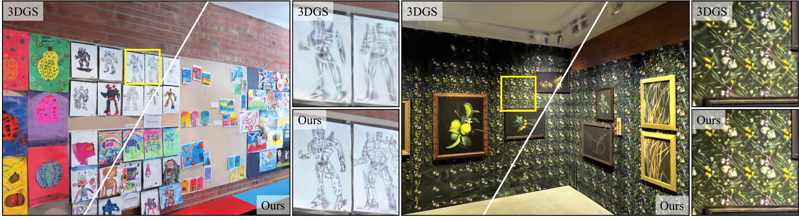
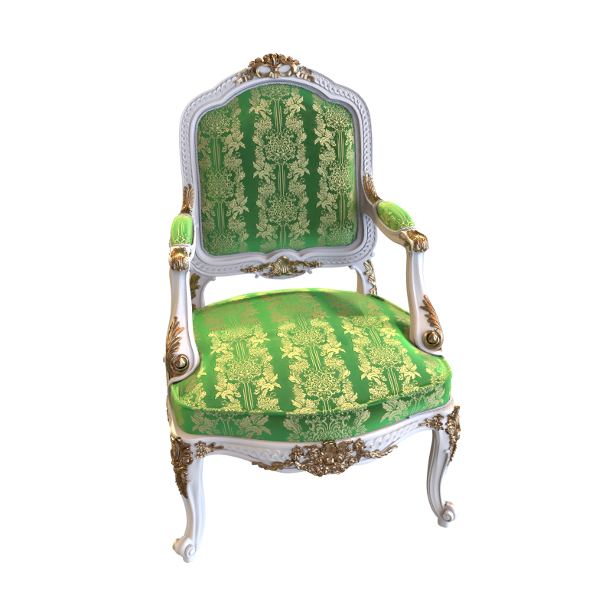
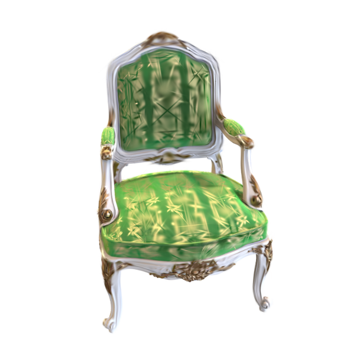

<h1 align="center"> Textured Gaussians for Enhanced 3D Scene Appearance Modeling</h1>
<p align="center"><b>CVPR 2025</b></p>
<p align="center"><a href="https://textured-gaussians.github.io" target="_blank">Project Page</a> | <a href="https://arxiv.org/abs/2411.18625" target="_blank">Paper</a>


<p align="center">
<a href="https://bchao1.github.io" target="_blank">Brian Chao<sup>1,2</sup></a>, 
<a href="https://hytseng0509.github.io" target="_blank">Hung-Yu Tseng<sup>1</sup></a>, 
<a href="https://scholar.google.it/citations?user=vW1gaVEAAAAJ&hl=it" target="_blank">Lorenzo Porzi<sup>1</sup></a>, 
<a href="https://www.chengao.vision" target="_blank">Chen Gao<sup>1</sup></a>, 
<a href="https://scholar.google.com/citations?user=jGQeuBUAAAAJ" target="_blank">Tuotuo Li<sup>1</sup></a>, 
<a href="https://www.qinboli.com" target="_blank">Qinbo Li<sup>1</sup></a>, 
<a href="https://scholar.google.com/citations?user=bluhHm8AAAAJ&hl=en" target="_blank">Ayush Saraf<sup>1</sup></a>, 
<a href="https://jbhuang0604.github.io/" target="_blank">Jia-Bin Huang<sup>1,3</sup></a>, 
<a href="https://johanneskopf.de/" target="_blank">Johannes Kopf<sup>1</sup></a>,  
<a href="https://stanford.edu/~gordonwz/" target="_blank">Gordon Wetzstein<sup>2</sup></a>, 
<a href="https://changilkim.com" target="_blank">Changil Kim<sup>1</sup></a></p>

<p align="center"><sup>1</sup>Meta, <sup>2</sup>Stanford University, <sup>3</sup>University of Maryland, College Park</p>



## Disclaimer

This is an updated version of the code accompanying the paper. Major changes include:
- Exact [2DGS](https://surfsplatting.github.io/) rasterization is used instead of flattening 3D Gaussians and using 3DGS rasterization as used in the original implementation. This is a more accurate way of mapping 2D textures to Gaussians.
- The [3DGS-MCMC](https://ubc-vision.github.io/3dgs-mcmc/) densificaiton strategy is used to flexibly control the number of Gaussians in the model.

The original code that was used for the experiments in the paper was built on top of a Meta internal codebase and therefore is not publicly available. This codebase is not an official release from Meta and is not maintained by Meta.

To facilitate open-source research and ease of use, this codebase is built on top of the [`gsplat`](https://github.com/nerfstudio-project/gsplat) software library. All features from `gsplat==1.4.0` are preserved in this codebase, so you can use this same codebase to train 2DGS, 3DGS, and Textured Gaussians. 


## Setup
The code was tested on:
- **OS**: Ubuntu 22.04.5 LTS
- **GPU**: NVIDIA RTX A6000
- **Driver Version**: 560.35.03 
- **CUDA Version**: 12.6
- **nvcc**: 11.5
- **Python Version**: 3.12.7
- **Torch Version**: 2.4.1

To create a conda environment with the same dependencies as the codebase, please run:
```bash
conda env create -f environment.yml
```

If the above command does not work, please create a new conda environment and install the dependencies manually (especially torch and torchvision).
```bash
conda create -n textured_gaussians python=3.12.7
conda activate textured_gaussians
```

Then, clone this repository and install the Textured Gaussians codebase by running:
```bash
git clone https://github.com/bchao1/textured-gaussians.git
cd textured-gaussians
python -m pip install -e . # install in editable mode for development
```


## Dataset
- You can download the NeRF synthetic dataset [here](https://drive.google.com/file/d/1OsiBs2udl32-1CqTXCitmov4NQCYdA9g/view?usp=share_link) and the Mip-NeRF 360 dataset [here](https://jonbarron.info/mipnerf360/).
- Custom data loaders that support NeRF synthetic dataset and COLMAP dataset formats are defined in `examples/datasets/`. You can easily extend the code to support your own dataset. 

## Optimization
Textured Gaussians are optimized in two stages: the 2DGS pre-training stage and the Textured Gaussians refinement stage. 

Please refer to the `scripts/` folder for examples on how to run the code. The default trainer Python script is `examples/simple_trainer_textured_gaussians.py` that supports both 2DGS and Textured Gaussians optimization. The script also automatically computes the image quality metrics (PSNR, SSIM, LPIPS) and saves them to a json file.

### Stage 1: 2DGS Pre-training
```bash
cd ../examples
python simple_trainer_textured_gaussians.py mcmc \
    --data_dir DATASET_DIR \
    --result_dir RESULT_DIR \
    --dataset "blender" \ # "colmap" for Mip-NeRF 360
    --init_extent 1 \ # remove for Mip-NeRF 360
    --init_type "random" \ # "sfm" for Mip-NeRF 360
    --background_mode "white" \ # remove for Mip-NeRF 360
    --model_type=2dgs \
    --init_num_pts MAX_GAUSSIANS \
    --strategy.cap-max MAX_GAUSSIANS \
    --alpha_loss \ # remove for Mip-NeRF 360
    --texture_resolution 50 \
    --port 6070
```

### Stage 2: Textured Gaussians Refinement
After 2DGS pre-training, texture maps are added to the model and the model is refined with the Textured Gaussians optimization.
```bash
cd ../examples
python simple_trainer_textured_gaussians.py mcmc \
    --data_dir DATASET_DIR \
    --pretrained_path PRETRAINED_PATH \ # path to the 2DGS pre-trained model
    --result_dir RESULT_DIR \
    --dataset "blender" \ # "colmap" for Mip-NeRF 360
    --init_extent 1 \ # remove for Mip-NeRF 360
    --init_type "pretrained" \
    --background_mode "white" \ # remove for Mip-NeRF 360
    --model_type=textured_gaussians \
    --init_num_pts MAX_GAUSSIANS \
    --strategy.cap-max MAX_GAUSSIANS \
    --strategy.refine-start-iter=1000000000000 \
    --alpha_loss \ # remove for Mip-NeRF 360                
    --textured_rgb \ # remove if no RGB texture is used
    --textured_alpha \ # remove if no alpha texture is used
    --texture_resolution 50 \
    --port 6070
```

## Results
Examples of 2DGS and Textured Gaussians optimization results are shown below. The number of Gaussians used in both models is 10000 and the RGBA textured map resolution for Textured Gaussians is 50x50.

<table>
  <tr>
    <th>Ground Truth</th>
    <th>2DGS</th>
    <th>Textured Gaussians</th>
  </tr>
  <tr>
    <td></td>
    <td></td>
    <td></td>
  </tr>
</table>


## License

This codebase is Apache 2.0 licensed. Please refer to the [LICENSE](LICENSE) file for more details.

## Citation
If you find our work useful, please cite:

```bibtex
@inproceedings{chao2025texturedgaussians,
    title={Textured Gaussians for Enhanced 3D Scene Appearance Modeling},
    author={Brian Chao and Hung-Yu Tseng and Lorenzo Porzi and Chen Gao and Tuotuo Li and Qinbo Li and Ayush Saraf and Jia-Bin Huang and Johannes Kopf and Gordon Wetzstein and Changil Kim},
    year={2025},
    booktitle={CVPR}
}
```
